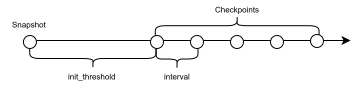

# WormCache

A behavior model of a multiprocessor cache hierarchy.

The project is still under development.

## Quick Start

#### 1. Environment Setup

This project requires [Rust](https://www.rust-lang.org/) to compile the cache behavior model, and optionally [Nix](https://nixos.org/) to compile QEMU. Rust is a system programming language, while Nix is a package manager for automatic dependency management. We recommend using [Determinate Systems' Nix installer](https://github.com/DeterminateSystems/nix-installer) to install Nix, which provides the necessary experimental feature ([flakes](https://nixos.wiki/wiki/Flakes)) for this project.

#### 2. Compile QEMU

First, clone the customized QEMU version for this project:

```bash
git clone --branch dev/pf https://github.com/parsa-epfl/qemu
```

###### Using Nix for QEMU Compilation

If you are using Nix, run the following command to start the development environment under the `qemu` folder:

```bash
nix develop -k HOME -i .
```

Nix will automatically install the necessary dependencies for building QEMU. Once Nix completes, you should see the message "Under Nix build environment." on your screen, and a new shell will be launched with all required environments properly set up.

You can then run the configure and build phases within this shell to build QEMU:

```bash
$configurationPhase
$buildPhase
```

After building, you should see the ARM64 QEMU binary located at `build/qemu-system-aarch64`.

###### No Nix for QEMU Compilation

If you're not using Nix, you'll need to install the required dependencies manually. You can find a full list of these dependencies under `buildInputs` in the `flake.nix` file. Note that some dependencies, including the C compiler, are not included.

#### 3. Compile Cache Model

Clone this repository:

```bash
git clone --branch dev https://github.com/parsa-epfl/WormCache
```

Modify the cache model parameters in `src/parameter.rs` as needed. After making your changes, compile the model:

```bash
cargo build --relesae
```

The compiled binary should be located in target/release/libworm_cache.so. This shared library will be used as a [QEMU Plugin](https://www.qemu.org/docs/master/devel/tcg-plugins.html) in the next steps.


#### 4. Prepare QEMU Snapshot

You'll need to prepare a virtual machine image for booting QEMU. We suggest downloading the [Debian Quick Images](https://people.debian.org/~gio/dqib/) for ARM64 virt, which include a README file with the necessary command-line options for starting QEMU. Make sure to use the QEMU instance compiled in the previous step to boot the image.

At this stage, we do not enable the cache model in QEMU, as simulating the cache can significantly reduce QEMU's emulation speed, making it difficult to boot Linux. Instead, we recommend creating a snapshot of the system first and using that snapshot as the starting point for cache simulation.

Once you've booted the QEMU virtual machine and started your application, you can create a system snapshot after the application reaches a stable state. Follow these steps:

1. Press `Ctrl + A`, then press `C`. You should see the prompt `(qemu)`, indicating that you have entered the QEMU console.
2. Type `savevm <name>` in the QEMU console. This command will create a snapshot with the specified `<name>`.

After creating the snapshot, you can exit QEMU by typing `q` in the console.

#### 5. Load QEMU Snapshot with Plugin

Copy the script you used in the previous step, and enable the cache model by adding the following options to the QEMU command line:

```bash
-rtc clock=vm \
-icount shift=0,sleep=off,align=off,q=1 \
-singlestep \
-d nochain \
-plugin <path_to_libworm_cache.so> \
-loadvm <name>
```

Here’s what these parameters mean:
- `rtc`: Creates a clock for the system, driven by QEMU virtual time.
- `icount`: Enables QEMU's icount mode, where the virtual clock advances based on executed instructions. This mode runs QEMU in single-threaded mode.
    - `shift=0`: Each instruction advances the virtual clock by 2^0 ns.
    - `sleep=off`: Prevents the system from sleeping when all CPUs are idle.
    - `align=off`: Disables the alignment of the clock with the host time.
    - `q=1`: Sets the time slice for each core, i.e., the number of instructions executed before switching to the next core. This setting mimics the atomic mode in gem5 for simulating multiprocessors.
- `singlestep` and `-d nochain`: Disables TCG optimizations, including chaining and coarse-grained translation, required for q=1.
- `plugin`: Specifies the QEMU plugin to enable, which in this case is the cache model.
- `loadvm`: Loads the snapshot for this run, with the name of the QEMU snapshot created in the previous step.


You can now start the simulation. The cache model will generate a `cache-misses.csv` file, which records the frequency of each event every 10 seconds. You can use this file to calculate the cache miss rate.


## Parallel Functional Warming

Another use of the cache model is to create checkpoints for sampling simulations. The cache model is designed to be thread-safe, allowing it to run alongside the parallel emulation of QEMU.

The following steps outline how to periodically generate checkpoints of the cache hierarchy. We assume you have already created a snapshot.

#### 1. Check the Affinity Setting of QEMU

To minimize noise, the affinity setting of each QEMU emulation thread is hardcoded to a specific core. You can find the relevant code in `accel/tcg/tcg-accel-ops-mttcg.c`. Search for `pthread_setaffinity_np` for details.

Recompile QEMU after making any changes to the affinity settings.

Please note that the number of host cores allocated to QEMU should exceed the number of target cores being simulated.


#### 2. Update QEMU Options

Add the following options to the script used for booting Linux:

```bash
-rtc clock=vm \
-plugin <path_to_libworm_cache.so>,vtime=on,mode=warm,init_threshold=<I>,interval=<I>,count=<N>,check_duration=1000 \
-loadvm <name>
```

Compared to the options used for measurement, this script omits the `icount` option, allowing the emulation to run in parallel.

Here are the plugin options explained:

- `vtime=on`: Allows the plugin to control QEMU virtual time. The plugin periodically profiles the instruction execution speed of non-sleeping cores and determines the slowdown factor between the host clock advancement speed and the virtual clock’s.
- `mode=warm`: Enables the plugin to periodically count the number of user-space instructions executed on all cores and generate a checkpoint when the count exceeds a threshold. The following parameters are used:
    - `init_threshold` and `interval`: `init_threshold` denotes the number of user-space instructions that must be executed before generating the first checkpoint. `interval` specifies the number of user-space instructions between two consecutive checkpoints (refer to the figure below). 
    - `count`: The number of checkpoints to generate before exiting QEMU.
    - `check_duration`: The interval, in milliseconds of host time, for the plugin to check the total number of user-space instructions. Setting this value too low can limit scalability, while setting it too high can affect the precision of the moment to create the checkpoint.
    - `prefix`: An optional parameter to specify a prefix for the checkpoint names. By default, the prefix is snapshot, resulting in checkpoint names like `snapshot_1`, `snapshot_2`, and so on.
- `loadvm`: The name of the snapshot to use as the starting point for functional warming.


After running the command, you should see checkpoints generated in the current folder with names like `snapshot_N.zstd`. These checkpoints can be loaded into QEMU in icount mode for cache behavior simulation.


